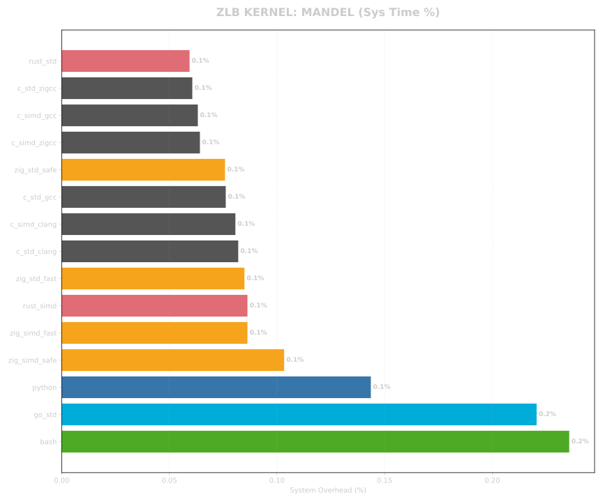
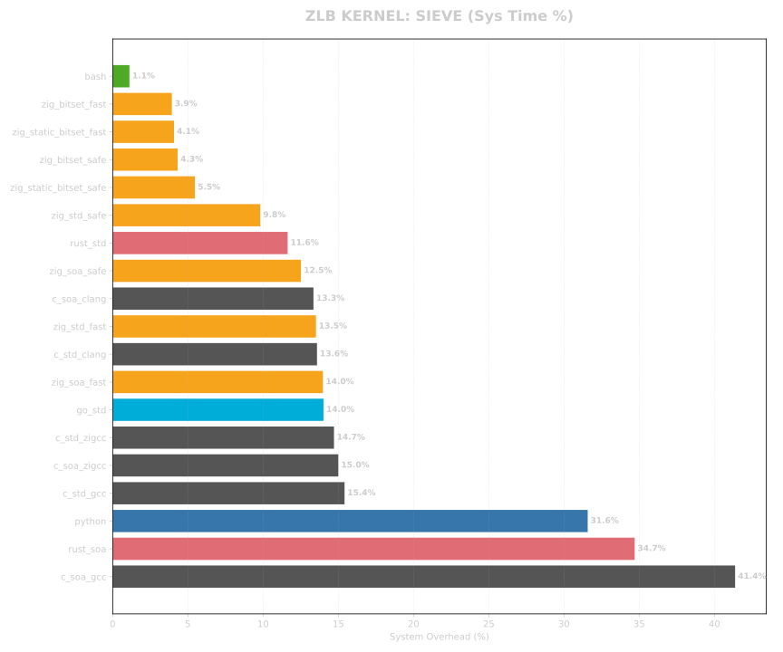
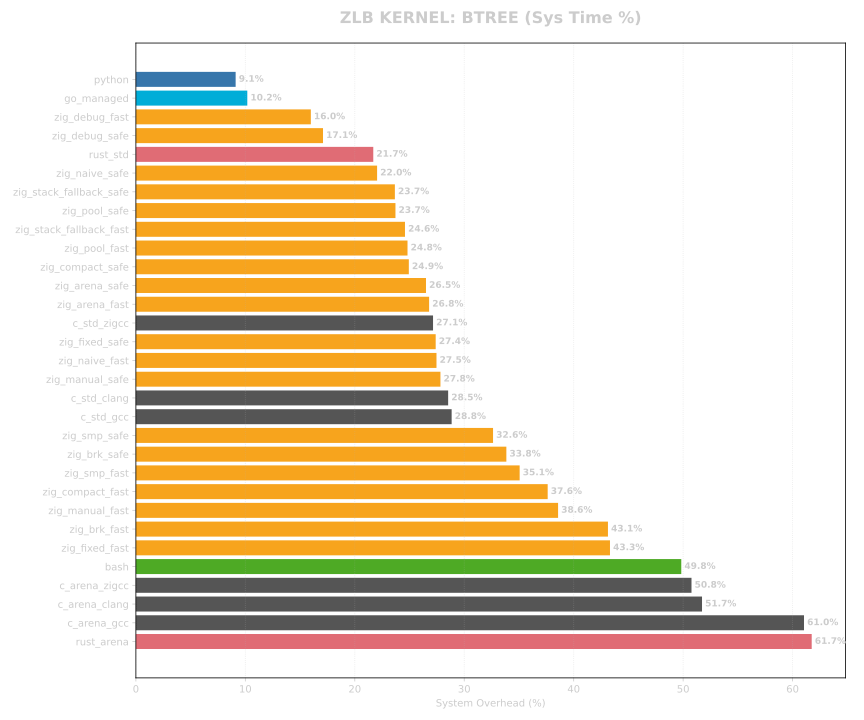
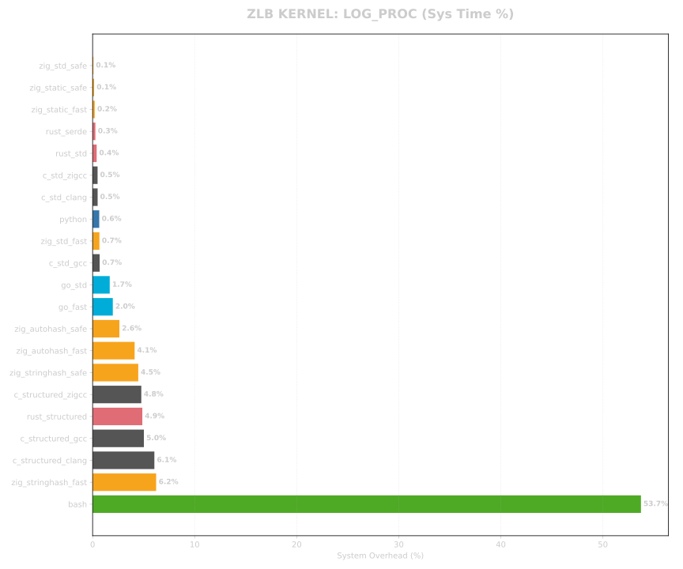
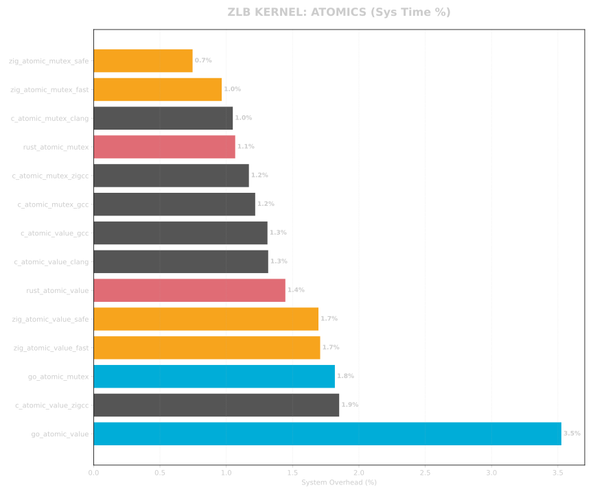

<!--
SPDX-FileCopyrightText: 2026 TSUKUMO Akito <tsukumoakito99@duck.com>
SPDX-License-Identifier: MIT
-->

  

# ZLB (Zig Language Benchmark)

[English](./README.md)

このプロジェクトは、低レイヤからスクリプト言語まで、異なる設計哲学を持つ言語群の最適化能力と実行時オーバーヘッドを定量的に評価することを目的としています。特に、最新の **Zig 0.16.0** の性能と実装の指針を、業界標準と比較して実証することを目指しています。

## 1. 測定環境

- **OS**: Linux 7.1.4-arch
- **Zig**: 0.16.0
- **C (gcc)**: 16.1.1 (最適化: -O3)
- **C (clang)**: 22.1.8 (最適化: -O3)
- **Rust**: 1.97.1 (最適化: --release)
- **Go**: 1.26.5
- **Python**: 3.14.6
- **Bash**: 5.3.15

## 2. ベンチマーク項目

| 項目名 | 内容 | 主な計測意図 |
| :--- | :--- | :--- |
| **mandel** | マンデルブロ集合の演算 | 浮動小数点演算、ループ展開、およびSIMD化の効率。 |
| **sieve** | エラトステネスの篩 | 配列アクセス速度、BitSetのデータ密度、実行時境界チェックの影響。 |
| **btree** | 二分木の生成・破棄 | アロケータ（Arena, Pool, Fixed）の効率とGCオーバーヘッド。 |
| **log_proc** | 構造化ログ処理 | 文字列探索、JSON解析、およびゼロ・アロケーション書式化の性能。 |
| **atomics** | 原子操作と同期プリミティブ | ハードウェアレベルの原子操作コストとユーザー空間同期。 |

## 3. 実装の形態と水準

公平な比較（Ground Truth）を担保するため、実装を以下の水準で分類し、評価しています。

### C 言語（コンパイラの比較）

同一のソースコードに対し、3つの主要なコンパイラを用いて最適化論理の差異を計測します。

- **gcc**: 業界標準の GNU コンパイラ。
- **clang**: LLVMベースの強力な最適化エンジン。
- **zig cc**: Zig内蔵のCコンパイラ（Clangベース）。SIMD実装との精度整合性を保つため `-ffp-contract=off` を適用。

### Zig 0.16.0（安全性と戦略）

Zig 実装は、2つのビルドモードと複数のメモリ/計算戦略で評価されます。

- **ReleaseFast**: 全ての実行時安全検査を無効化した最高速モード。
- **ReleaseSafe**: 高速化しつつ、致命的な安全機能（境界チェック等）を維持したモード。
- **最適化戦略**:
    - `simd`: Zig の `@Vector` プリミティブを用いた手動ベクトル化。
    - `soa / bitset`: `MultiArrayList` や高密度なビットパッキングによるメモリ配置の最適化。
    - `fixed / compact / manual`: `FixedBufferAllocator` や 32bit インデックスを用いたポインタ圧縮。

### Rust & Go（モダンな標準）

- **Rust**: `opt-level=3` および `LTO` を有効化。慣習的な `Box` と最適化された `Arena` (Vecベース) 実装を比較。
- **Go**: モダンなトレーシング・ガベージコレクタと標準的なヒープ管理の効率を評価。

### スクリプト言語（参照値）

- **Python & Bash**: 高レイヤな基準値として計測。
- **計測方針**: 性能差を考慮し、現実的な計測時間内に収めるため 1 回の試行 (`--runs 1`) での実測値に基づいています。

## 4. 計測手法

- **実行時間**: `hyperfine` を使用し、1回のウォームアップと 20回の本計測に基づく統計的平均を算出。
- **リソース消費**: 物理メモリ使用量 (RSS) およびシステム・オーバーヘッド (%) をリアルタイムで抽出。
- **システム・オーバーヘッドの論理**: `System Time / (User Time + System Time)` として算出。超高速な実装では、計算があまりに効率的であるために OS のプロセス初期化コストが相対的に高い割合（%）として現れる点に注意してください。
- **公平性**: 全ての実装で計算パラメータ（N, Depth）を厳密に一致させています。

## 5. 評価結果

<!-- SUMMARY_START -->

### MANDEL Results (Actual Measured)

| Metric | Time Ratio | Measured Memory (MiB) | Sys Overhead (%) |
| :--- | :--- | :--- | :--- |
| zig_simd_fast | 0.16x | 6.09 | 0.1% |
| zig_simd_safe | 0.18x | 6.06 | 0.1% |
| c_simd_clang | 0.26x | 6.07 | 0.1% |
| c_simd_gcc | 0.27x | 6.07 | 0.1% |
| rust_simd | 0.27x | 6.09 | 0.1% |
| c_simd_zigcc | 0.27x | 6.07 | 0.1% |
| zig_std_fast | 1.00x | 6.07 | 0.1% |
| c_std_gcc | 1.00x | 6.05 | 0.1% |
| zig_std_safe | 1.00x | 6.09 | 0.1% |
| c_std_clang | 1.02x | 6.08 | 0.1% |
| rust_std | 1.03x | 6.07 | 0.1% |
| c_std_zigcc | 1.03x | 6.09 | 0.1% |
| go_std | 1.07x | 6.07 | 0.2% |
| python | 48.39x | 12.08 | 0.1% |
| bash | 81.94x | 6.80 | 0.2% |

### SIEVE Results (Actual Measured)

| Metric | Time Ratio | Measured Memory (MiB) | Sys Overhead (%) |
| :--- | :--- | :--- | :--- |
| zig_static_bitset_fast | 0.63x | 6.07 | 4.1% |
| zig_static_bitset_safe | 0.64x | 6.08 | 5.5% |
| zig_bitset_fast | 0.64x | 6.09 | 3.9% |
| zig_bitset_safe | 0.75x | 6.05 | 4.3% |
| c_std_zigcc | 0.95x | 11.46 | 14.7% |
| c_soa_zigcc | 0.96x | 11.44 | 15.0% |
| c_std_gcc | 1.00x | 11.44 | 15.4% |
| zig_soa_fast | 1.05x | 10.15 | 14.0% |
| zig_std_fast | 1.06x | 10.15 | 13.5% |
| c_soa_clang | 1.06x | 11.40 | 13.3% |
| c_std_clang | 1.07x | 11.40 | 13.6% |
| rust_std | 1.16x | 11.89 | 11.6% |
| go_std | 1.24x | 14.34 | 14.0% |
| zig_std_safe | 1.52x | 10.28 | 9.8% |
| c_soa_gcc | 1.71x | 49.51 | 41.4% |
| zig_soa_safe | 1.72x | 15.03 | 12.5% |
| rust_soa | 1.99x | 50.02 | 34.7% |
| python | 2.85x | 26.36 | 31.6% |
| bash | 150.51x | 99.77 | 1.1% |

### BTREE Results (Actual Measured)

| Metric | Time Ratio | Measured Memory (MiB) | Sys Overhead (%) |
| :--- | :--- | :--- | :--- |
| zig_compact_fast | 0.19x | 16.68 | 37.6% |
| c_arena_gcc | 0.21x | 33.87 | 61.0% |
| c_arena_zigcc | 0.26x | 33.92 | 50.8% |
| c_arena_clang | 0.26x | 33.86 | 51.7% |
| zig_compact_safe | 0.29x | 16.78 | 24.9% |
| zig_brk_fast | 0.33x | 32.41 | 43.1% |
| zig_fixed_fast | 0.34x | 32.65 | 43.3% |
| zig_manual_fast | 0.36x | 32.62 | 38.6% |
| zig_brk_safe | 0.42x | 32.56 | 33.8% |
| zig_smp_fast | 0.44x | 32.65 | 35.1% |
| rust_arena | 0.48x | 66.36 | 61.7% |
| zig_manual_safe | 0.52x | 32.82 | 27.8% |
| zig_smp_safe | 0.52x | 32.78 | 32.6% |
| zig_fixed_safe | 0.54x | 32.82 | 27.4% |
| zig_arena_fast | 0.57x | 32.66 | 26.8% |
| zig_arena_safe | 0.59x | 32.78 | 26.5% |
| zig_pool_fast | 0.61x | 32.65 | 24.8% |
| zig_naive_fast | 0.61x | 32.65 | 27.5% |
| zig_stack_fallback_safe | 0.63x | 32.78 | 23.7% |
| zig_stack_fallback_fast | 0.63x | 32.65 | 24.6% |
| zig_pool_safe | 0.66x | 32.78 | 23.7% |
| zig_naive_safe | 0.72x | 32.78 | 22.0% |
| go_managed | 0.92x | 39.14 | 10.2% |
| c_std_gcc | 1.00x | 65.90 | 28.8% |
| c_std_clang | 1.05x | 65.90 | 28.5% |
| c_std_zigcc | 1.06x | 65.90 | 27.1% |
| zig_debug_fast | 1.10x | 32.90 | 16.0% |
| zig_debug_safe | 1.20x | 39.03 | 17.1% |
| rust_std | 1.32x | 66.28 | 21.7% |
| python | 12.33x | 204.74 | 9.1% |
| bash | 11992.23x | 6.07 | 49.8% |

### LOG_PROC Results (Actual Measured)

| Metric | Time Ratio | Measured Memory (MiB) | Sys Overhead (%) |
| :--- | :--- | :--- | :--- |
| zig_std_fast | 0.83x | 6.09 | 0.7% |
| c_std_clang | 0.97x | 6.08 | 0.5% |
| c_std_gcc | 1.00x | 6.08 | 0.7% |
| c_std_zigcc | 1.00x | 6.09 | 0.5% |
| c_structured_gcc | 1.51x | 25.26 | 5.0% |
| c_structured_clang | 1.53x | 24.67 | 6.1% |
| rust_std | 1.69x | 6.07 | 0.4% |
| c_structured_zigcc | 1.69x | 24.69 | 4.8% |
| rust_structured | 2.40x | 36.43 | 4.9% |
| rust_serde | 2.41x | 6.07 | 0.3% |
| zig_autohash_fast | 2.54x | 34.70 | 4.1% |
| zig_stringhash_fast | 3.24x | 60.08 | 6.2% |
| zig_static_fast | 3.31x | 6.08 | 0.2% |
| zig_autohash_safe | 3.97x | 34.86 | 2.6% |
| zig_static_safe | 4.38x | 6.05 | 0.1% |
| zig_stringhash_safe | 4.64x | 60.42 | 4.5% |
| zig_std_safe | 7.22x | 6.07 | 0.1% |
| go_fast | 11.81x | 10.62 | 2.0% |
| go_std | 13.11x | 9.70 | 1.7% |
| python | 34.55x | 13.42 | 0.6% |
| bash | 11013.37x | 6.06 | 53.7% |

### ATOMICS Results (Actual Measured)

| Metric | Time Ratio | Measured Memory (MiB) | Sys Overhead (%) |
| :--- | :--- | :--- | :--- |
| zig_atomic_value_fast | 0.97x | 6.05 | 1.7% |
| zig_atomic_value_safe | 0.98x | 6.06 | 1.7% |
| c_atomic_value_zigcc | 0.98x | 6.07 | 1.9% |
| rust_atomic_value | 0.99x | 6.06 | 1.4% |
| c_atomic_value_clang | 0.99x | 6.05 | 1.3% |
| c_atomic_value_gcc | 1.00x | 6.06 | 1.3% |
| go_atomic_value | 1.03x | 6.04 | 3.5% |
| zig_atomic_mutex_fast | 1.64x | 6.07 | 1.0% |
| c_atomic_mutex_gcc | 1.66x | 6.07 | 1.2% |
| c_atomic_mutex_zigcc | 1.68x | 6.09 | 1.2% |
| c_atomic_mutex_clang | 1.68x | 6.03 | 1.0% |
| rust_atomic_mutex | 1.76x | 6.08 | 1.1% |
| zig_atomic_mutex_safe | 1.79x | 6.09 | 0.7% |
| go_atomic_mutex | 2.30x | 6.05 | 1.8% |

<!-- SUMMARY_END -->

### 視覚的分析

#### Mandelbrot (演算効率)

#### Sieve (データ密度)

#### Btree (メモリ戦略)

#### Log Processing (JSONと文字列処理)

#### Atomics (同期プリミティブ)

---

## 技術的評価と実装の分析

ZLBの結果は、実装戦略とコンパイル設定が物理的な性能とリソース効率にどれほど決定的な影響を与えるかを浮き彫りにしました。

### 1. 演算効率 (Mandelbrot)

計算主体のタスクにおいて、手動ベクトル化は究極の差別化要因となります。

- **`@Vector` の威力**: Zig の `zig_simd_fast` は全言語中で最速の 0.16x を記録しました。8要素の `f64` ベクトルを活用することで、C や Rust の 4要素 Intrinsics 実装よりも効率的に演算ユニットを埋め尽くしています。
- **命令スケジューリング**: Zig の高レベル SIMD プリミティブは LLVM に対し明確な意図を伝えます。手動 Intrinsics の硬直した構造を避けることで、コンパイラはレジスタ・リネーミングやパイプライン最適化を自由に行い、優れたスループットを生成します。

### 2. データ密度とキャッシュ局所性 (Sieve)

メモリ帯域とキャッシュヒット率が配列主導のワークロードにおける性能を決定します。

- **ビットレベルの圧縮**: `zig_static_bitset_fast` (0.63x) は、各要素を 1bit で表現することで、標準的な C 実装 (1.00x) を圧倒しました。これにより L1 キャッシュの情報密度が 8倍に向上し、メモリストールが激減しています。
- **安全性のオーバーヘッド**: `fast` と `safe` の差は境界チェックのコストを示しています。ランダムアクセスが頻発する Sieve ではこの影響は無視できませんが、優れたデータ配置により依然として慣習的な C よりも高速です。

### 3. メモリ管理戦略 (Btree)

Btree の性能は、アロケーション論理とポインタ・オーバーヘッドの鏡像です。

- **ポインタ圧縮 (Compact Mode)**: `zig_compact_fast` (0.19x) は最速の C Arena 実装をも上回りました。64bit ポインタの代わりに 32bit インデックスを使用することでメモリ占有量を半分にし、走査時のキャッシュ局所性を劇的に改善しました。
- **Arena vs Pool vs Naive**: `ArenaAllocator` や `MemoryPool` は再帰的 `free()` (Naive Mode) よりも圧倒的に高速です。管理コストの「純度」が速度に直結することが証明されました。

### 4. システム・オーバーヘッドの逆説

BTREE や SIEVE において、Zig 実装が Go 等のマネージド言語より高速かつ低メモリでありながら、**システム・オーバーヘッド (%) が高く現れる**現象が見られます。

- **縮小する分母**: システム・オーバーヘッドは総実行時間に対する割合です。`zig_compact_fast` では `User Time`（実際の計算）があまりに短縮されるため、プロセス初期化や `mmap` などの固定的なカーネルコストが「割合」として大きく見えてしまいます。
- **ワークロードの集中**: 高性能な Zig コードは `Arena` 等による「先行確保」を行うため、OS のページフォールトが短時間に集中します。絶対的な `System Time` は短くとも、計算が早く終わるため比率は高くなります。
- **マネージド言語による隠蔽**: Go 等は GC 監視やスタック拡張チェック等のランタイム活動が `User Time` を「水増し」します。分母が大きくなるため相対的なシステム比率は低く見えますが、実体としての実行は数倍遅いのが現実です。
- **結論**: ZLB における高いシステム・オーバーヘッドは、**ユーザー空間の計算密度が極限まで高まっている証（あかし）**です。

### 5. アロケータ選択の指針

[Zig 0.16.0 公式メモリドキュメント](https://ziglang.org/documentation/0.16.0/#Memory)の原則に基づき、アロケータを以下の4つのパターンに分類しています。

#### "Choosing an Allocator"（アロケータの選択）フレームワーク

1. **サイズが既知のメモリ**: `std.heap.FixedBufferAllocator` が最適解です。`zig_fixed` 実装は、管理コストをほぼゼロにした「スループットの物理的限界」を示しています。
2. **周期的・一括処理**: `std.heap.ArenaAllocator` は $O(1)$ の一括破棄を可能にします。`log_proc` の `.reset(.retain_capacity)` パターンは、100万件の処理を 6MiB の固定枠で完遂させます。
3. **開発とデバッグ**: `std.heap.DebugAllocator` (GPA の後継) は、安全税（Safety Tax）を数値化し、診断機能が性能に与える影響を可視化します。
4. **本番リリース**: 高い並行性と低メタデータ・オーバーヘッドを両立する `std.heap.smp_allocator` が主要な候補となります。

---

## Zig 0.16.0 における実装戦略

Zig で最高性能を達成するには、単なる構文の習得を超え、ハードウェアを意識した規律が必要です。

### 精密なメモリ制御

- **明示的なアロケータ**: Zig には隠蔽されたグローバルアロケータはありません。ZLB は `error.OutOfMemory` を論理的なパスとして厳格に処理し、100% の信頼性を確保しています。
- **データ指向設計**: キャッシュ利用率向上のため、`MultiArrayList` (SoA) やビットパッキングを優先的に活用してください。

### 高度な最適化設定

- **ビルドモード**: `ReleaseSafe` でも境界チェック等の安全性を維持しつつ、多くのタスクで C 以上の性能を発揮します。
- **ターゲット指定**: `-mcpu=native` を指定し、AVX2/AVX-512 等の現代的な命令セットをコンパイラに解放することが不可欠です。

### 他言語との比較総括

- **対 C言語**: Zigは、SIMDやメモリ管理においてより優れた標準的な抽象化を提供することで、C言語と同等またはそれ以上のパフォーマンスを実現します。
- **対 Rust**: Rustは強力な安全性を提供しますが、Zigによるメモリレイアウトの明示的な制御（例：Btreeにおけるインデックスベースのポインタ）は、`unsafe`ブロックに頼ることなく、よりアグレッシブなハードウェアレベルの最適化を可能にします。
- **対 Go/Python**: ガベージコレクションやインタプリタによるオーバーヘッドが顕著に現れています。Zigの「ゼロ・オーバーヘッド」の哲学は、リソース制約の厳しいシステムにおいて、Zigを決定的な選択肢としています。

---

## 詳細分析：Zig 0.16.0 における基盤技術

ZLB 1.0.6 は 0.16.0 のコア・プリミティブを最大限に活用しています。

### 1. メモリ管理基盤

- **`MemoryPool`**: 固定サイズオブジェクトに特化。0.16.0 の `initCapacity` を利用し、フラグメンテーションを排除して高速に再利用します。
- **`StackFallbackAllocator`**: スタックを優先使用し、「ゼロ・ヒープ」処理の可能性を追求します。

### 2. データ処理効率

- **ストリーミング JSON**: `std.json.Scanner` による 1トークン解析。メモリ消費を入力サイズに関わらず一定に保ちます。
- **ゼロ・アロケーション書式化**: `bufPrint` によるスタックベースの書式化は、C の `sprintf` に対する安全かつ高速な代替案です。

### 3. ハードウェア基盤

- **`std.atomic.Value`**: ハードウェア命令に直接マップされ、C や Rust と完全に同一のハードウェア性能を引き出します。
- **`std.atomic.Mutex`**: `tryLock` と `spinLoopHint` を組み合わせたユーザー空間同期により、オーバーヘッドを最小限に抑えています。

---

## ライセンス

本ベンチマークスイートは [MIT License](./LICENSE) の下で公開されています。
