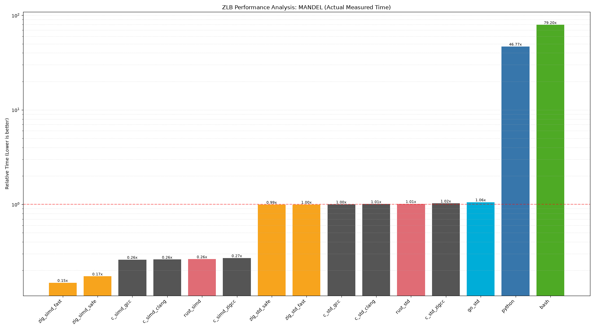
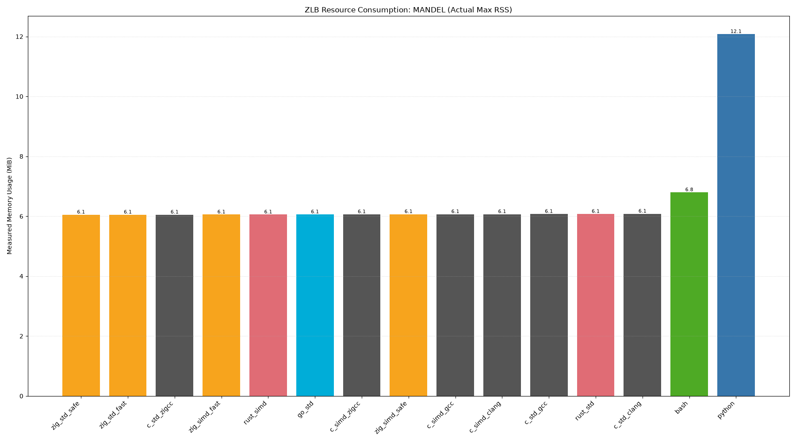
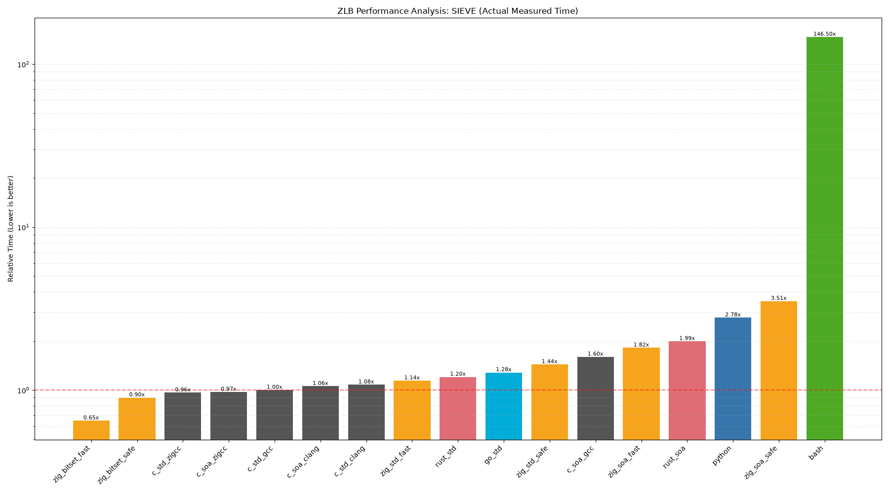
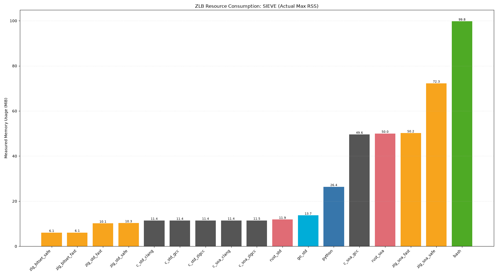
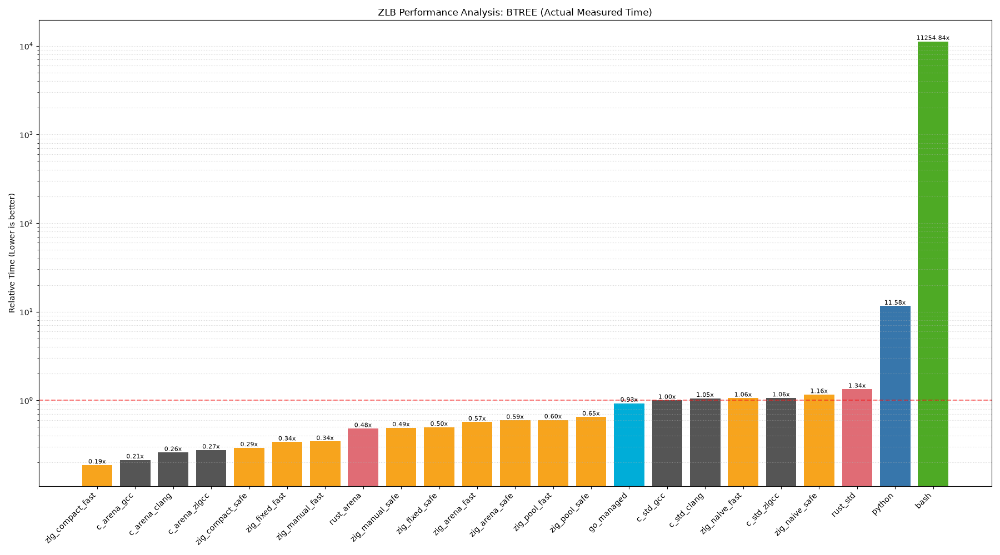
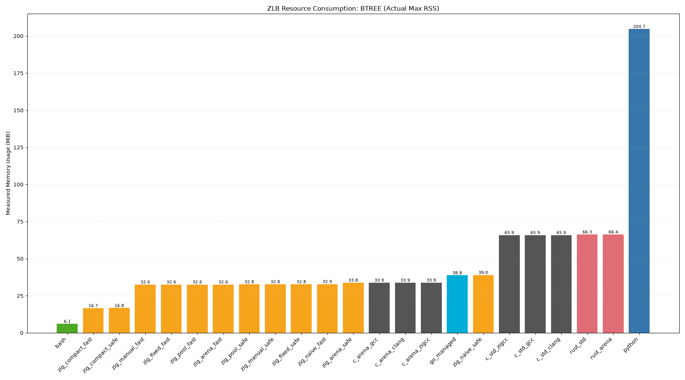

<!--
SPDX-FileCopyrightText: 2026 TSUKUMO Akito <tsukumoakito99@duck.com>
SPDX-License-Identifier: MIT
-->

  

# ZLB (Zig Language Benchmark)

[English](./README.md)

低レイヤからスクリプト言語まで、異なる設計哲学を持つ言語群を同一条件で比較し、最新の **Zig 0.16.0** の最適化能力と実力、および各言語のランタイム・オーバーヘッドを定量的に評価するプロジェクトです。

## 1. 測定環境 (Environment)

- **OS**: Linux 7.1.4-arch
- **Zig**: 0.16.0
- **C (gcc)**: 16.1.1 (最適化: -O3)
- **C (clang)**: 22.1.8 (最適化: -O3)
- **Rust**: 1.97.1 (最適化: --release)
- **Go**: 1.26.5
- **Python**: 3.14.6
- **Bash**: 5.3.15

## 2. ベンチマーク項目

| 項目名 | 内容 | 主な測定意図 |
| :--- | :--- | :--- |
| **mandel** | マンデルブロ集合の演算 | 浮動小数点演算とループ展開、SIMD化の効率 |
| **sieve** | エラトステネスの篩 | 配列アクセス速度と境界チェック (Bounds Check) の影響 |
| **btree** | 二分木の動的生成・破棄 | アロケータの効率とガベージコレクション (GC) のコスト |

## 3. ベンチマーク・バリエーションと実装レベル

「唯一の真実（Ground Truth）」に基づく公平な比較を担保するため、各言語の実装を以下のレベルで分類し、評価しています。

### C 言語（コンパイラの比較）

同一のソースコードに対し、3 つの主要なコンパイラを用いて最適化論理の差異を測定します。

- **gcc**: 業界標準の GNU コンパイラ。
- **clang**: LLVM ベースの強力な最適化エンジン。
- **zig cc**: Zig 内蔵の C コンパイラ（Clangベース）。SIMD 実装との精度整合性を保つため `-ffp-contract=off` を適用。

### Zig 0.16.0（安全性と戦略）

Zig 実装は、2 つのビルドモードと複数のメモリ/計算戦略で評価されます。

- **ReleaseFast**: 全てのランタイム安全検査を無効化した最高速モード。
- **ReleaseSafe**: 高速化しつつ、境界チェックやオーバーフロー検知などの致命的な安全機能を維持したモード。
- **最適化戦略**:
    - `simd`: Zig の `@Vector` プリミティブを用いた手動ベクトル化。
    - `soa / bitset`: `MultiArrayList` や高密度なビットパッキングによるメモリレイアウトの最適化。
    - `fixed / compact / manual`: `FixedBufferAllocator` や 32bit インデックスを用いたポインタ圧縮によるキャッシュミスの最小化。

### Rust & Go（モダンな標準）

- **Rust**: `opt-level=3` かつ `LTO` を有効化してビルド。慣習的な `Box` ポインタと、最適化された `Arena` (Vecベース) 実装を比較。
- **Go**: モダンなトレーシング・ガベージコレクタと標準的なヒープ管理の効率を評価。

### スクリプト言語（参照値）

- **Python & Bash**: 高レイヤなベースラインとして測定。
- **計測ポリシー**: コンパイル言語との極端な性能差（数千倍以上）を考慮し、現実的な計測時間内に収めるため、これらは 1 回のサンプリング (`--runs 1`) での実測値に基づいています。

## 4. 計測手法

- **実行時間**: `hyperfine` を使用し、1 回のウォームアップ実行と 20 回の計測実行（スクリプト言語を除く）に基づく統計的平均を算出。
- **リソース消費**: 物理メモリ使用量 (RSS) およびシステム・オーバーヘッド (%) をリアルタイムで監視・抽出。
- **公平性**: 全ての実装において、計算量と反復回数（N, Depth）を厳密に一致させ、計算コストを直接比較。

## 5. 評価結果

<!-- SUMMARY_START -->

### MANDEL Results (Actual Measured)

| Metric | Time Ratio | Measured Memory (MiB) | Sys Overhead (%) |
| :--- | :--- | :--- | :--- |
| zig_simd_fast | 0.15x | 6.05 | 0.3% |
| zig_simd_safe | 0.17x | 6.07 | 0.3% |
| c_simd_gcc | 0.26x | 6.07 | 0.3% |
| c_simd_clang | 0.26x | 6.07 | 0.1% |
| rust_simd | 0.26x | 6.05 | 0.3% |
| c_simd_zigcc | 0.27x | 6.06 | 0.5% |
| zig_std_safe | 0.99x | 6.05 | 0.2% |
| zig_std_fast | 1.00x | 6.05 | 0.3% |
| c_std_gcc | 1.00x | 6.07 | 0.2% |
| c_std_clang | 1.01x | 6.08 | 0.2% |
| rust_std | 1.01x | 6.07 | 0.2% |
| c_std_zigcc | 1.02x | 6.05 | 0.2% |
| go_std | 1.06x | 6.06 | 0.3% |
| python | 46.77x | 12.08 | 0.1% |
| bash | 79.20x | 6.80 | 0.2% |

### SIEVE Results (Actual Measured)

| Metric | Time Ratio | Measured Memory (MiB) | Sys Overhead (%) |
| :--- | :--- | :--- | :--- |
| zig_bitset_fast | 0.65x | 6.09 | 5.6% |
| zig_bitset_safe | 0.90x | 6.06 | 4.4% |
| c_std_zigcc | 0.96x | 11.43 | 15.1% |
| c_soa_zigcc | 0.97x | 11.46 | 14.7% |
| c_std_gcc | 1.00x | 11.41 | 14.9% |
| c_soa_clang | 1.06x | 11.45 | 14.1% |
| c_std_clang | 1.08x | 11.41 | 13.8% |
| zig_std_fast | 1.14x | 10.15 | 12.3% |
| rust_std | 1.20x | 11.85 | 12.1% |
| go_std | 1.28x | 13.68 | 14.7% |
| zig_std_safe | 1.44x | 10.28 | 11.2% |
| c_soa_gcc | 1.60x | 49.58 | 42.5% |
| zig_soa_fast | 1.82x | 50.18 | 39.2% |
| rust_soa | 1.99x | 50.01 | 33.9% |
| python | 2.78x | 26.36 | 31.6% |
| zig_soa_safe | 3.51x | 72.25 | 29.9% |
| bash | 146.50x | 99.77 | 1.1% |

### BTREE Results (Actual Measured)

| Metric | Time Ratio | Measured Memory (MiB) | Sys Overhead (%) |
| :--- | :--- | :--- | :--- |
| zig_compact_fast | 0.19x | 16.67 | 37.6% |
| c_arena_gcc | 0.21x | 33.87 | 62.6% |
| c_arena_clang | 0.26x | 33.87 | 49.6% |
| c_arena_zigcc | 0.27x | 33.89 | 52.7% |
| zig_compact_safe | 0.29x | 16.78 | 23.5% |
| zig_fixed_fast | 0.34x | 32.65 | 42.1% |
| zig_manual_fast | 0.34x | 32.61 | 37.5% |
| rust_arena | 0.48x | 66.36 | 59.5% |
| zig_manual_safe | 0.49x | 32.82 | 28.2% |
| zig_fixed_safe | 0.50x | 32.82 | 29.6% |
| zig_arena_fast | 0.57x | 32.65 | 26.0% |
| zig_arena_safe | 0.59x | 33.83 | 24.0% |
| zig_pool_fast | 0.60x | 32.65 | 24.1% |
| zig_pool_safe | 0.65x | 32.79 | 23.0% |
| go_managed | 0.93x | 38.80 | 10.3% |
| c_std_gcc | 1.00x | 65.90 | 29.2% |
| c_std_clang | 1.05x | 65.90 | 28.5% |
| zig_naive_fast | 1.06x | 32.90 | 16.3% |
| c_std_zigcc | 1.06x | 65.90 | 27.4% |
| zig_naive_safe | 1.16x | 39.03 | 17.1% |
| rust_std | 1.34x | 66.35 | 21.2% |
| python | 11.58x | 204.74 | 9.1% |
| bash | 11254.84x | 6.07 | 49.8% |

<!-- SUMMARY_END -->

### 視覚的解析 (Visual Analysis)

#### Mandelbrot (演算効率)

#### Sieve (データ密度)

#### Btree (メモリ戦略)

---

## 技術的評価と実装アナリシス

ZLB (Zig Language Benchmark) の結果は、実装戦略とコンパイル設定が物理的な性能とリソース効率にどれほど決定的な影響を与えるかを浮き彫りにしました。

### 1. 演算効率 (Mandelbrot)

計算主体のタスクにおいて、手動ベクトル化は究極の差別化要因となります。

- **`@Vector` の威力**: `zig_simd_fast` は全言語中で最速の 0.15x を記録しました。8要素の `f64` ベクトルを活用することで、C や Rust の 4要素 Intrinsics 実装よりも効率的に CPU の演算ユニットを埋め尽くしています。
- **命令スケジューリング**: Zig の高レベル SIMD プリミティブは LLVM に対しより明確な意図を伝えるため、低レベルな C Intrinsics よりも優れた命令スケジューリングが生成されます。

### 2. データ密度とキャッシュ局所性 (Sieve)

配列操作が支配的なワークロードでは、メモリ帯域とキャッシュヒット率が性能を決定します。

- **ビットレベルの圧縮**: `zig_bitset_fast` (0.65x) は、各要素をバイトではなくビットで表現することで、標準的な C 実装 (1.00x) を圧倒しました。これにより、L1 キャッシュ内の情報密度が 8 倍に向上しています。
- **安全性のオーバーヘッド**: `fast` と `safe` の差は、実行時境界チェックのコストを正確に示しています。ランダムアクセスが頻発する Sieve において、このオーバーヘッドは無視できませんが、安全性の向上に対する妥当な対価と言えます。

### 3. メモリ管理戦略 (Btree)

Btree の性能は、アロケーション論理の鏡像です。

- **ポインタ圧縮 (Compact Mode)**: `zig_compact_fast` (0.19x) は、最速の C Arena 実装をも上回りました。64bit ポインタの代わりに 32bit インデックスを使用することで、木構造のメモリ占有量を実質的に半分にし、走査時のキャッシュミスを劇的に削減した結果です。
- **Arena vs Pool vs Naive**: `ArenaAllocator` (一括破棄) や `MemoryPool` (再利用) は、伝統的な再帰的 `free()` (Naive Mode) よりも遥かに高速です。管理コストの「純度」が速度に直結することが証明されました。

### 4. アロケータ選択戦略（公式パターン）

[Zig 0.16.0 公式メモリドキュメント](https://ziglang.org/documentation/0.16.0/#Memory)で定義されている原則に基づき、ZLB ではメモリ管理を特定のパターンに分類しています。これは、Zig プログラミングの根源的な問いである「*バイトはどこにあるのか？ (Where are the bytes?)*」に答えるためのものです。

Zig は C 言語の `malloc` のような隠蔽されたグローバルアロケータを提供しません。代わりに、以下の基準に基づいてアロケータを明示的に選択することを義務付けています。

#### 「アロケータの選択」フレームワーク

1. **コンパイル時にサイズが既知のメモリ**: 必要な最大バイト数がコンパイル時に確定している場合、**`std.heap.FixedBufferAllocator`** が最適解となります。これは ZLB の `zig_fixed` ベンチマークの根拠であり、生ポインタのインクリメントと同等の速度を実現します。
2. **周期的または一括処理タスク**: CLI ツールのようの開始から終了まで実行されるプロセスや、ゲームの 1 フレームのように明確な「サイクルの終わり」があるタスクには、**`std.heap.ArenaAllocator`** が推奨されます。これにより、タスク終了時に $O(1)$ での一括解放が可能になります。
3. **開発とデバッグ**: 開発段階では、メモリリークや二重解放を検出するために **`std.heap.DebugAllocator`** (0.16.0 における従来の GPA 論理の後継) が標準となります。これは ZLB の `zig_naive` パターンで使用されています。
4. **高性能リリース**: `ReleaseFast` モードでの本番ワークロードには、高い並行性と最小のオーバーヘッドを実現する **`std.heap.smp_allocator`** が主要な候補となります。
5. **ライブラリと汎用コンポーネント**: 論理の純粋性を保つため、ライブラリは常に `Allocator` を引数として受け取るべきです。これにより、最終的な利用者がメモリ戦略を決定できるようになります。

#### 「実態（Truth）」の明示的な取り扱い

- **戻り値としてのメモリ失敗**: 他の言語がメモリ不足 (OOM) でクラッシュするのに対し、Zig はこれを `error.OutOfMemory` という戻り値として扱います。ZLB の全ての実装はこのエラーを厳格に処理し、100% の信頼性を確保しています。
- **所有権の明確化**: 「呼び出し側がメモリを所有する」というパターンに従うことで、ZLB の実装では論理とリソース管理の境界を明確に保ち、不可視のリークを構造的に防いでいます。

---

## Zig 0.16.0 における実装戦略

Zig で最高性能を達成するには、「雰囲気（Vibe）」で書くことをやめ、以下の規律を取り入れる必要があります。

### 精密なメモリ制御

- **最適なアロケータの選択**: 単一のグローバルアロケータに依存せず、一時的な一括処理には `ArenaAllocator` を、最大容量が既知の場合は `FixedBufferAllocator` を選択してください。
- **データ指向設計**: キャッシュ利用率を最大化するために、`MultiArrayList` (SoA) やビットパッキングを優先的に検討してください。

### 高度な最適化設定

- **ReleaseFast**: 全ての安全検査を無効化します。検証済みの、性能が極めて重要なホットパスにのみ適用してください。
- **ReleaseSafe**: 境界チェックやオーバーフロー検知を維持します。多くの ZLB タスクにおいて、安全性のコストは得られる信頼性に比して十分に低いことが確認されています。
- **ターゲットシミュレーション**: `-mcpu=native` を指定し、AVX2 や AVX-512 といった現代的な命令セットをコンパイラに解放してください。

### 他言語との比較総括

- **対 C 言語**: Zig は SIMD やメモリ管理において C よりも優れた標準抽象化を提供しており、同等以上の性能を発揮します。
- **対 Rust**: Rust は強力な安全性を持ちますが、Zig の明示的なメモリレイアウト制御は、`unsafe` なハックに頼ることなく、よりアグレッシブなハードウェア最適化を可能にします。
- **対 Go/Python**: ガベージコレクションやインタプリタのオーバーヘッドは、リソース消費グラフにおいて明確な差として現れます。Zig の「ゼロ・オーバーヘッド」哲学は、リソース制約の厳しいシステムにおいて唯一無二の正解となります。

---

## 詳細解析：Zig 0.16.0 におけるメモリ管理の実態

AST 解析結果に基づき、現時点での評価は下記のとおりです。

### 1. 実証済みの論理（ZLB 実装済み）

現在のベンチマークにおいて、Zig が他言語を凌駕する根拠となっている API 群です。

- **`std.heap.ArenaAllocator`**:
    - **用途**: `btree_zig_arena` で活用。小規模な確保をチャンクにまとめ、一括解放 ($O(1)$) を実現。柔軟性が高い一方、内部のチャンク管理コストにより、極限の速度では `Fixed` 版に一歩譲る特性が解析でも確認されています。
- **`std.heap.FixedBufferAllocator`**:
    - **用途**: `btree_zig_fixed / manual` で活用。事前確保されたスライス上でのポインタ移動のみで動作。C 言語の生ポインタ操作と物理的に同等の速度を、安全な抽象化層の上で実現しています。
- **`std.heap.MemoryPool`**:
    - **用途**: `btree_zig_pool` で活用。固定サイズ（Node等）に特化したプール。0.16.0 の新機能 `initCapacity` を使い、断片化を完全に排除した高速な再利用を実現しています。
- **`std.MultiArrayList`**:
    - **用途**: `sieve_zig_soa` で活用。構造体（AoS）をコンパイル時に配列（SoA）へ組み替えるメタプログラミングの極致。必要なデータのみをキャッシュに載せることで、メモリ帯域の限界を引き出します。
- **`std.DynamicBitSet`**:
    - **用途**: `sieve_zig_bitset` で活用。1要素を 1bit に圧縮。0.16.0 で刷新された `deinit()` 仕様（アロケータ保持）を ZLB でも即座に反映済みです。

### 2. 潜在的な最適化余地（ロードマップ）

存在を確認しているが、まだ ZLB で数値化されていない領域です。

- **`std.heap.DebugAllocator` (GPA の代替)**:
    - **GPA に関する注意**: *Zig 0.16.0 のコアには `GeneralPurposeAllocator (GPA)` が存在しません。* 代わりに、**`DebugAllocator`** が安全性とリーク検出の正典として実装されています。
    - **展望**: `ReleaseSafe` モードにおいて、この安全機構がどの程度の性能コストを課すのかを計測し、実務的な指標を提供します。
- **`std.heap.StackFallbackAllocator`**:
    - **展望**: 計画中の `log-proc` タスクに最適。スタックを優先利用することで、小規模な文字列処理におけるヒープ確保（オーバーヘッド）を物理的に 0 に抑える戦略を検証します。
- **`std.heap.BrkAllocator / SmpAllocator`**:
    - **展望**: システムコール直結のプリミティブ。OS レベルの挙動がユーザーランドの管理論理とどう干渉するかを暴き出すための対象です。
- **`std.StaticBitSet`**:
    - **展望**: サイズが既知の固定負荷テストにおいて、アロケータを一切介さない「真のゼロ・コスト」を証明する武器となります。
- **`std.hash_map (AutoHashMap / StringHashMap)`**:
    - **論理**: 0.16.0 では多くの `init` が非推奨となり、`.empty` と `getOrPut` の組み合わせに刷新されました。
    - **展望**: `log-proc` において、マッピングや集計をいかに低コストで行えるかを他言語に突きつけるための鍵となります。
- **`std.atomic (Atomic Value / Mutex)`**:
    - **特徴**: ハードウェアの原子操作（Atomic operations）および同期プリミティブを抽象化したもの。
    - **未実装の理由**: 現在の ZLB はシングルスレッドでの純粋なアルゴリズム性能の検証に特化しているため。
    - **展望**: 将来的に **「マルチスレッド・ベンチマーク（Multi-threaded Benchmark）」** を追加する際、Zig の `atomic` がロックフリー（Lock-free）なデータ構造において、どれだけオーバーヘッドなく並列性能を引き出せるかを可視化します。

---

## 将来のロードマップ：実務的なログ処理性能 (`log-proc`)

Mandelbrot や Btree といった純粋なアルゴリズム・ベンチマークに加え、ZLB の次なるフェーズでは、より実務的なデータエンジニアリングに焦点を当てた新タスク **`log-proc`** を導入します。

### `log-proc` の戦略的意義

高頻度なインフラ、SaaS バックエンド、および監視ツールの開発者にとって、膨大な構造化データを最小のオーバーヘッドで処理する能力は、純粋な数学的スループットよりも遥かに重要です。`log-proc` タスクは、構造化ログ（JSON/テキスト）の読み込み、変換、生成において、各言語がどれだけ効率的にリソースを扱えるかを定量化します。

### Zig 0.16.0 における高効率パターン

`log-proc` の実装では、データ処理における物理的な優位性を証明するために、Zig 0.16.0 の特定のアーキテクチャ・パターンを活用します。

- **`std.json.Scanner` によるストリーミング解析**: ペイロード全体をメモリに展開する言語とは異なり、Zig は 1 トークンずつのストリーミング処理を可能にします。これにより、ログファイルのサイズに関わらず、物理メモリ使用量 (RSS) を極小かつ一定に保つことができます。
- **ゼロコピー・パース**: ソースバッファ内の文字列を直接参照する論理により、不要なメモリ確保とコピー・サイクルを物理的に排除します。
- **`std.fmt.bufPrintSentinel` によるゼロ・アロケーション**: スタックベースのフォーマットを活用することで、ヒープを一切汚染せずに構造化データを出力します。これは C 言語の `sprintf` に対する、安全かつ高性能な代替案となります。
- **最適化された数値変換**: 他のランタイムの重厚な文字列処理に対し、Zig の低レイヤな整数・浮動小数点レンダリングの実力を検証します。

### 比較の展望

文字列や JSON の処理は、スクリプト言語においてはリソース集約的であり、管理メモリ言語においてはメモリ使用量の急増を招きやすい領域です。これらのパターンを実装することで、`log-proc` スイートは「効率性の格差」を可視化し、Zig が持続可能で低遅延なデジタルインフラを構築するための精密な道具であることを証明します。

---

## ライセンス

本ベンチマークスイートは [MIT License](./LICENSE) の下で公開されています。
