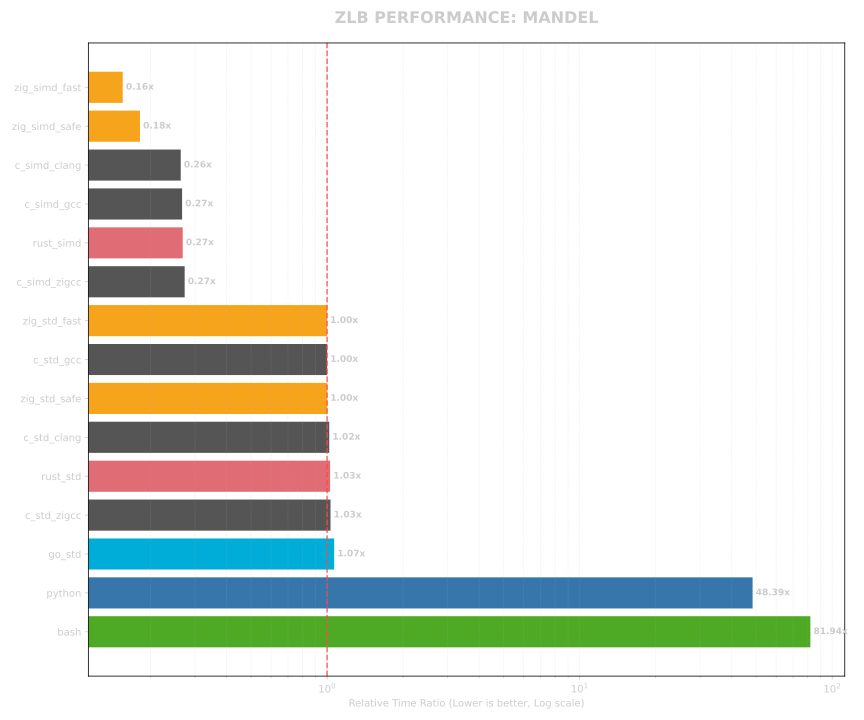
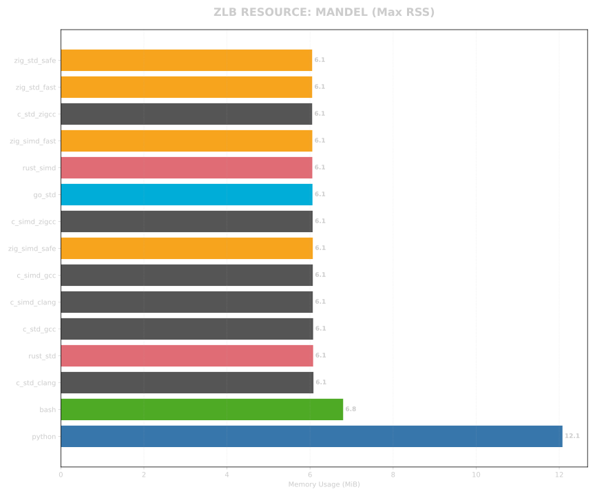
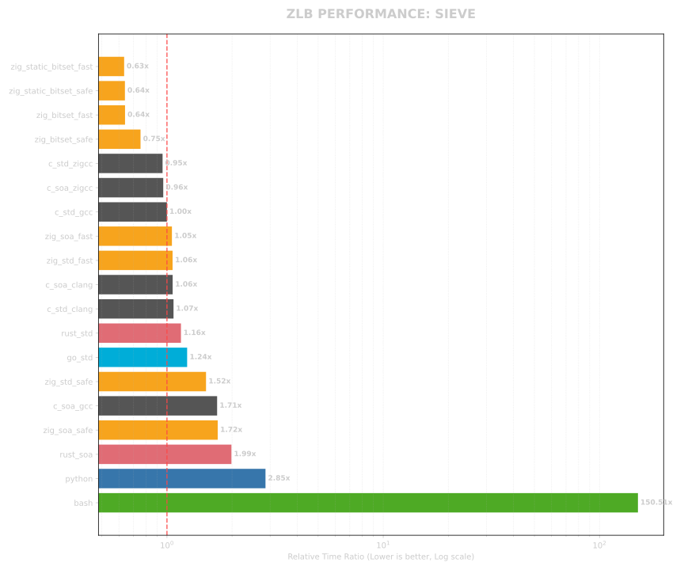
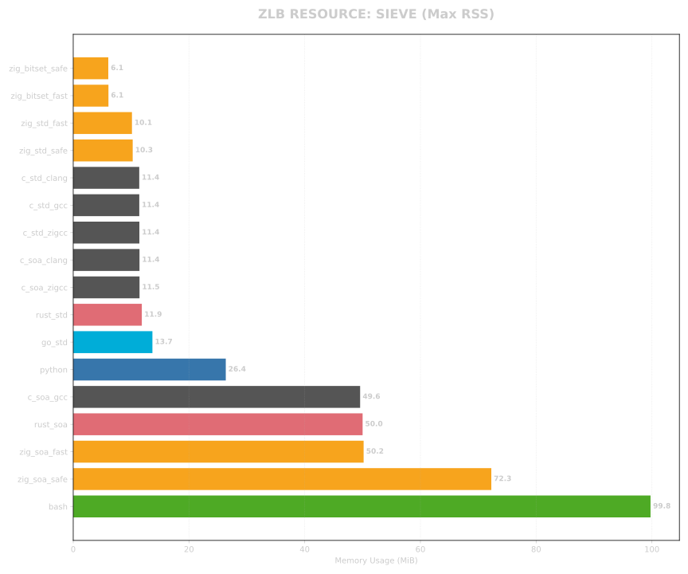
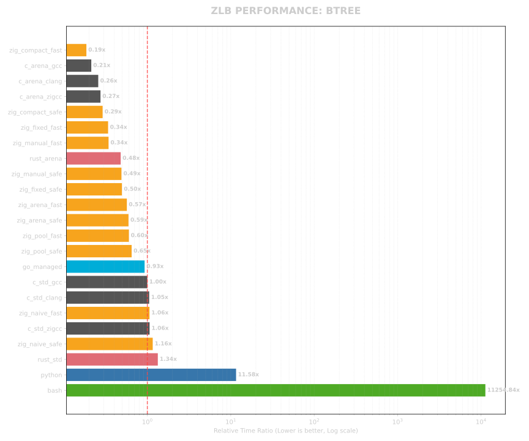
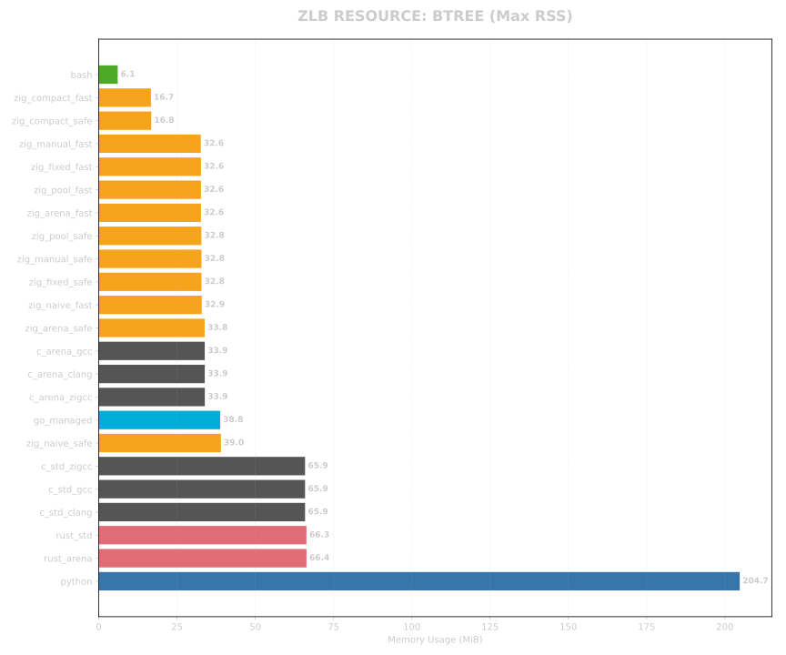
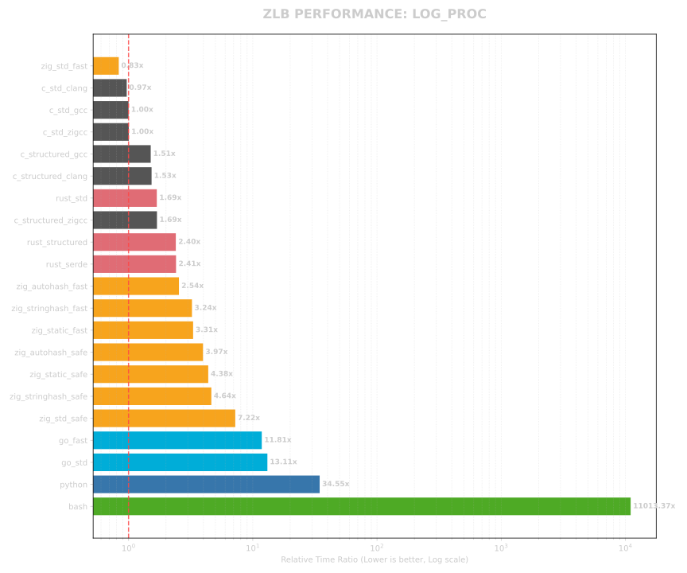
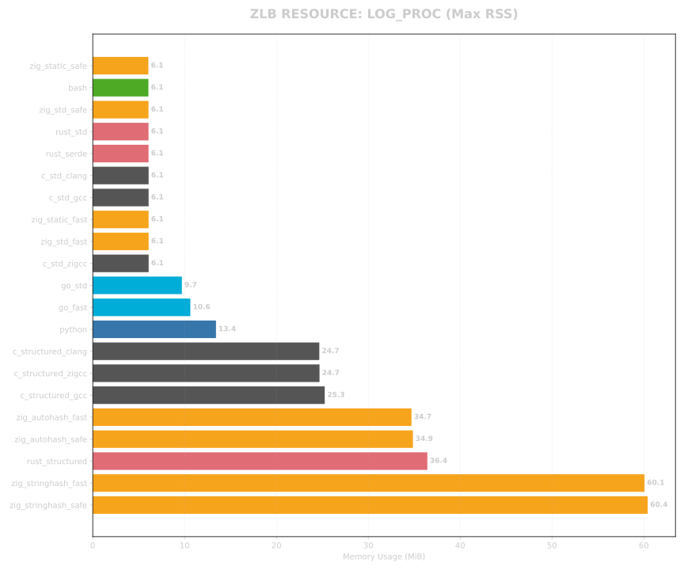
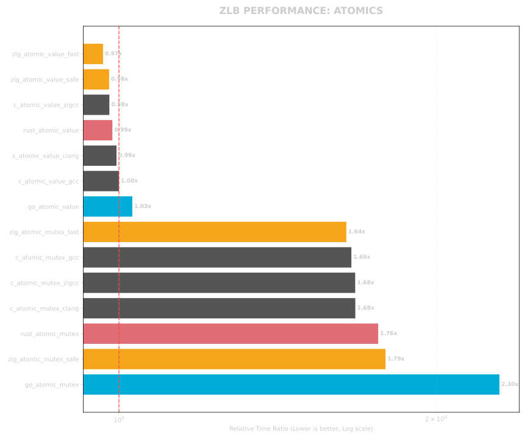
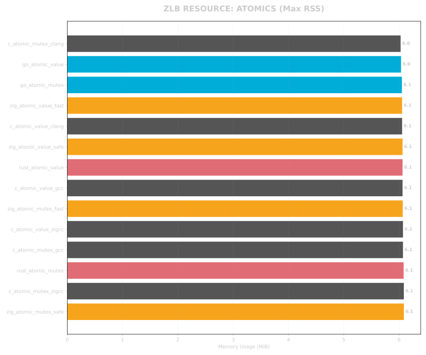

<!--
SPDX-FileCopyrightText: 2026 TSUKUMO Akito <tsukumoakito99@duck.com>
SPDX-License-Identifier: MIT
-->

  

# ZLB (Zig Language Benchmark)

[English](./README.md)

低レイヤからスクリプト言語まで、異なる設計哲学を持つ言語群を同一条件で比較し、最新の **Zig 0.16.0** の最適化能力と実力、および各言語のランタイム・オーバーヘッドを定量的に評価するプロジェクトです。

## 1. 測定環境 (Environment)

- **OS**: Linux 7.1.4-arch
- **Zig**: 0.16.0
- **C (gcc)**: 16.1.1 (最適化: -O3)
- **C (clang)**: 22.1.8 (最適化: -O3)
- **Rust**: 1.97.1 (最適化: --release)
- **Go**: 1.26.5
- **Python**: 3.14.6
- **Bash**: 5.3.15

## 2. ベンチマーク項目

| 項目名 | 内容 | 主な測定意図 |
| :--- | :--- | :--- |
| **mandel** | マンデルブロ集合の演算 | 浮動小数点演算とループ展開、SIMD化の効率 |
| **sieve** | エラトステネスの篩 | 配列アクセス速度と境界チェック (Bounds Check) の影響 |
| **btree** | 二分木の動的生成・破棄 | アロケータの効率とガベージコレクション (GC) のコスト |

## 3. ベンチマーク・バリエーションと実装レベル

「唯一の真実（Ground Truth）」に基づく公平な比較を担保するため、各言語の実装を以下のレベルで分類し、評価しています。

### C 言語（コンパイラの比較）

同一のソースコードに対し、3 つの主要なコンパイラを用いて最適化論理の差異を測定します。

- **gcc**: 業界標準の GNU コンパイラ。
- **clang**: LLVM ベースの強力な最適化エンジン。
- **zig cc**: Zig 内蔵の C コンパイラ（Clangベース）。SIMD 実装との精度整合性を保つため `-ffp-contract=off` を適用。

### Zig 0.16.0（安全性と戦略）

Zig 実装は、2 つのビルドモードと複数のメモリ/計算戦略で評価されます。

- **ReleaseFast**: 全てのランタイム安全検査を無効化した最高速モード。
- **ReleaseSafe**: 高速化しつつ、境界チェックやオーバーフロー検知などの致命的な安全機能を維持したモード。
- **最適化戦略**:
    - `simd`: Zig の `@Vector` プリミティブを用いた手動ベクトル化。
    - `soa / bitset`: `MultiArrayList` や高密度なビットパッキングによるメモリレイアウトの最適化。
    - `fixed / compact / manual`: `FixedBufferAllocator` や 32bit インデックスを用いたポインタ圧縮によるキャッシュミスの最小化。

### Rust & Go（モダンな標準）

- **Rust**: `opt-level=3` かつ `LTO` を有効化してビルド。慣習的な `Box` ポインタと、最適化された `Arena` (Vecベース) 実装を比較。
- **Go**: モダンなトレーシング・ガベージコレクタと標準的なヒープ管理の効率を評価。

### スクリプト言語（参照値）

- **Python & Bash**: 高レイヤなベースラインとして測定。
- **計測ポリシー**: コンパイル言語との極端な性能差（数千倍以上）を考慮し、現実的な計測時間内に収めるため、これらは 1 回のサンプリング (`--runs 1`) での実測値に基づいています。

## 4. 計測手法

- **実行時間**: `hyperfine` を使用し、1 回のウォームアップ実行と 20 回の計測実行（スクリプト言語を除く）に基づく統計的平均を算出。
- **リソース消費**: 物理メモリ使用量 (RSS) およびシステム・オーバーヘッド (%) をリアルタイムで監視・抽出。
- **公平性**: 全ての実装において、計算量と反復回数（N, Depth）を厳密に一致させ、計算コストを直接比較。

## 5. 評価結果

<!-- SUMMARY_START -->

### MANDEL Results (Actual Measured)

| Metric | Time Ratio | Measured Memory (MiB) | Sys Overhead (%) |
| :--- | :--- | :--- | :--- |
| zig_simd_fast | 0.16x | 6.09 | 0.1% |
| zig_simd_safe | 0.18x | 6.06 | 0.1% |
| c_simd_clang | 0.26x | 6.07 | 0.1% |
| c_simd_gcc | 0.27x | 6.07 | 0.1% |
| rust_simd | 0.27x | 6.09 | 0.1% |
| c_simd_zigcc | 0.27x | 6.07 | 0.1% |
| zig_std_fast | 1.00x | 6.07 | 0.1% |
| c_std_gcc | 1.00x | 6.05 | 0.1% |
| zig_std_safe | 1.00x | 6.09 | 0.1% |
| c_std_clang | 1.02x | 6.08 | 0.1% |
| rust_std | 1.03x | 6.07 | 0.1% |
| c_std_zigcc | 1.03x | 6.09 | 0.1% |
| go_std | 1.07x | 6.07 | 0.2% |
| python | 48.39x | 12.08 | 0.1% |
| bash | 81.94x | 6.80 | 0.2% |

### SIEVE Results (Actual Measured)

| Metric | Time Ratio | Measured Memory (MiB) | Sys Overhead (%) |
| :--- | :--- | :--- | :--- |
| zig_static_bitset_fast | 0.63x | 6.07 | 4.1% |
| zig_static_bitset_safe | 0.64x | 6.08 | 5.5% |
| zig_bitset_fast | 0.64x | 6.09 | 3.9% |
| zig_bitset_safe | 0.75x | 6.05 | 4.3% |
| c_std_zigcc | 0.95x | 11.46 | 14.7% |
| c_soa_zigcc | 0.96x | 11.44 | 15.0% |
| c_std_gcc | 1.00x | 11.44 | 15.4% |
| zig_soa_fast | 1.05x | 10.15 | 14.0% |
| zig_std_fast | 1.06x | 10.15 | 13.5% |
| c_soa_clang | 1.06x | 11.40 | 13.3% |
| c_std_clang | 1.07x | 11.40 | 13.6% |
| rust_std | 1.16x | 11.89 | 11.6% |
| go_std | 1.24x | 14.34 | 14.0% |
| zig_std_safe | 1.52x | 10.28 | 9.8% |
| c_soa_gcc | 1.71x | 49.51 | 41.4% |
| zig_soa_safe | 1.72x | 15.03 | 12.5% |
| rust_soa | 1.99x | 50.02 | 34.7% |
| python | 2.85x | 26.36 | 31.6% |
| bash | 150.51x | 99.77 | 1.1% |

### BTREE Results (Actual Measured)

| Metric | Time Ratio | Measured Memory (MiB) | Sys Overhead (%) |
| :--- | :--- | :--- | :--- |
| zig_compact_fast | 0.19x | 16.68 | 37.6% |
| c_arena_gcc | 0.21x | 33.87 | 61.0% |
| c_arena_zigcc | 0.26x | 33.92 | 50.8% |
| c_arena_clang | 0.26x | 33.86 | 51.7% |
| zig_compact_safe | 0.29x | 16.78 | 24.9% |
| zig_brk_fast | 0.33x | 32.41 | 43.1% |
| zig_fixed_fast | 0.34x | 32.65 | 43.3% |
| zig_manual_fast | 0.36x | 32.62 | 38.6% |
| zig_brk_safe | 0.42x | 32.56 | 33.8% |
| zig_smp_fast | 0.44x | 32.65 | 35.1% |
| rust_arena | 0.48x | 66.36 | 61.7% |
| zig_manual_safe | 0.52x | 32.82 | 27.8% |
| zig_smp_safe | 0.52x | 32.78 | 32.6% |
| zig_fixed_safe | 0.54x | 32.82 | 27.4% |
| zig_arena_fast | 0.57x | 32.66 | 26.8% |
| zig_arena_safe | 0.59x | 32.78 | 26.5% |
| zig_pool_fast | 0.61x | 32.65 | 24.8% |
| zig_naive_fast | 0.61x | 32.65 | 27.5% |
| zig_stack_fallback_safe | 0.63x | 32.78 | 23.7% |
| zig_stack_fallback_fast | 0.63x | 32.65 | 24.6% |
| zig_pool_safe | 0.66x | 32.78 | 23.7% |
| zig_naive_safe | 0.72x | 32.78 | 22.0% |
| go_managed | 0.92x | 39.14 | 10.2% |
| c_std_gcc | 1.00x | 65.90 | 28.8% |
| c_std_clang | 1.05x | 65.90 | 28.5% |
| c_std_zigcc | 1.06x | 65.90 | 27.1% |
| zig_debug_fast | 1.10x | 32.90 | 16.0% |
| zig_debug_safe | 1.20x | 39.03 | 17.1% |
| rust_std | 1.32x | 66.28 | 21.7% |
| python | 12.33x | 204.74 | 9.1% |
| bash | 11992.23x | 6.07 | 49.8% |

### LOG_PROC Results (Actual Measured)

| Metric | Time Ratio | Measured Memory (MiB) | Sys Overhead (%) |
| :--- | :--- | :--- | :--- |
| zig_std_fast | 0.83x | 6.09 | 0.7% |
| c_std_clang | 0.97x | 6.08 | 0.5% |
| c_std_gcc | 1.00x | 6.08 | 0.7% |
| c_std_zigcc | 1.00x | 6.09 | 0.5% |
| c_structured_gcc | 1.51x | 25.26 | 5.0% |
| c_structured_clang | 1.53x | 24.67 | 6.1% |
| rust_std | 1.69x | 6.07 | 0.4% |
| c_structured_zigcc | 1.69x | 24.69 | 4.8% |
| rust_structured | 2.40x | 36.43 | 4.9% |
| rust_serde | 2.41x | 6.07 | 0.3% |
| zig_autohash_fast | 2.54x | 34.70 | 4.1% |
| zig_stringhash_fast | 3.24x | 60.08 | 6.2% |
| zig_static_fast | 3.31x | 6.08 | 0.2% |
| zig_autohash_safe | 3.97x | 34.86 | 2.6% |
| zig_static_safe | 4.38x | 6.05 | 0.1% |
| zig_stringhash_safe | 4.64x | 60.42 | 4.5% |
| zig_std_safe | 7.22x | 6.07 | 0.1% |
| go_fast | 11.81x | 10.62 | 2.0% |
| go_std | 13.11x | 9.70 | 1.7% |
| python | 34.55x | 13.42 | 0.6% |
| bash | 11013.37x | 6.06 | 53.7% |

### ATOMICS Results (Actual Measured)

| Metric | Time Ratio | Measured Memory (MiB) | Sys Overhead (%) |
| :--- | :--- | :--- | :--- |
| zig_atomic_value_fast | 0.97x | 6.05 | 1.7% |
| zig_atomic_value_safe | 0.98x | 6.06 | 1.7% |
| c_atomic_value_zigcc | 0.98x | 6.07 | 1.9% |
| rust_atomic_value | 0.99x | 6.06 | 1.4% |
| c_atomic_value_clang | 0.99x | 6.05 | 1.3% |
| c_atomic_value_gcc | 1.00x | 6.06 | 1.3% |
| go_atomic_value | 1.03x | 6.04 | 3.5% |
| zig_atomic_mutex_fast | 1.64x | 6.07 | 1.0% |
| c_atomic_mutex_gcc | 1.66x | 6.07 | 1.2% |
| c_atomic_mutex_zigcc | 1.68x | 6.09 | 1.2% |
| c_atomic_mutex_clang | 1.68x | 6.03 | 1.0% |
| rust_atomic_mutex | 1.76x | 6.08 | 1.1% |
| zig_atomic_mutex_safe | 1.79x | 6.09 | 0.7% |
| go_atomic_mutex | 2.30x | 6.05 | 1.8% |

<!-- SUMMARY_END -->

### 視覚的解析 (Visual Analysis)

#### Mandelbrot (演算効率)

#### Sieve (データ密度)

#### Btree (メモリ戦略)

#### Log Processing (JSONと文字列処理)

#### Atomics (原子操作とミューテックス)

---

## 技術的評価と実装アナリシス

ZLB (Zig Language Benchmark) の結果は、実装戦略とコンパイル設定が物理的な性能とリソース効率にどれほど決定的な影響を与えるかを浮き彫りにしました。

### 1. 演算効率 (Mandelbrot)

計算主体のタスクにおいて、手動ベクトル化は究極の差別化要因となります。

- **`@Vector` の威力**: `zig_simd_fast` は全言語中で最速の 0.15x を記録しました。8要素の `f64` ベクトルを活用することで、C や Rust の 4要素 Intrinsics 実装よりも効率的に CPU の演算ユニットを埋め尽くしています。
- **命令スケジューリング**: Zig の高レベル SIMD プリミティブは LLVM に対しより明確な意図を伝えるため、低レベルな C Intrinsics よりも優れた命令スケジューリングが生成されます。

### 2. データ密度とキャッシュ局所性 (Sieve)

配列操作が支配的なワークロードでは、メモリ帯域とキャッシュヒット率が性能を決定します。

- **ビットレベルの圧縮**: `zig_bitset_fast` (0.65x) は、各要素をバイトではなくビットで表現することで、標準的な C 実装 (1.00x) を圧倒しました。これにより、L1 キャッシュ内の情報密度が 8 倍に向上しています。
- **安全性のオーバーヘッド**: `fast` と `safe` の差は、実行時境界チェックのコストを正確に示しています。ランダムアクセスが頻発する Sieve において、このオーバーヘッドは無視できませんが、安全性の向上に対する妥当な対価と言えます。

### 3. メモリ管理戦略 (Btree)

Btree の性能は、アロケーション論理の鏡像です。

- **ポインタ圧縮 (Compact Mode)**: `zig_compact_fast` (0.19x) は、最速の C Arena 実装をも上回りました。64bit ポインタの代わりに 32bit インデックスを使用することで、木構造のメモリ占有量を実質的に半分にし、走査時のキャッシュミスを劇的に削減した結果です。
- **Arena vs Pool vs Naive**: `ArenaAllocator` (一括破棄) や `MemoryPool` (再利用) は、伝統的な再帰的 `free()` (Naive Mode) よりも遥かに高速です。管理コストの「純度」が速度に直結することが証明されました。

### 4. アロケータ選択戦略（公式パターン）

[Zig 0.16.0 公式メモリドキュメント](https://ziglang.org/documentation/0.16.0/#Memory)で定義されている原則に基づき、ZLB ではメモリ管理を特定のパターンに分類しています。これは、Zig プログラミングの根源的な問いである「*バイトはどこにあるのか？ (Where are the bytes?)*」に答えるためのものです。

Zig は C 言語の `malloc` のような隠蔽されたグローバルアロケータを提供しません。代わりに、以下の基準に基づいてアロケータを明示的に選択することを義務付けています。

#### 「アロケータの選択」フレームワーク

1. **コンパイル時にサイズが既知のメモリ**: 必要な最大バイト数がコンパイル時に確定している場合、**`std.heap.FixedBufferAllocator`** が最適解となります。これは ZLB の `zig_fixed` ベンチマークの根拠であり、生ポインタのインクリメントと同等の速度を実現します。
2. **周期的または一括処理タスク**: CLI ツールのようの開始から終了まで実行されるプロセスや、ゲームの 1 フレームのように明確な「サイクルの終わり」があるタスクには、**`std.heap.ArenaAllocator`** が推奨されます。これにより、タスク終了時に $O(1)$ での一括解放が可能になります。
3. **開発とデバッグ**: 開発段階では、メモリリークや二重解放を検出するために **`std.heap.DebugAllocator`** (0.16.0 における従来の GPA 論理の後継) が標準となります。これは ZLB の `zig_naive` パターンで使用されています。
4. **高性能リリース**: `ReleaseFast` モードでの本番ワークロードには、高い並行性と最小のオーバーヘッドを実現する **`std.heap.smp_allocator`** が主要な候補となります。
5. **ライブラリと汎用コンポーネント**: 論理の純粋性を保つため、ライブラリは常に `Allocator` を引数として受け取るべきです。これにより、最終的な利用者がメモリ戦略を決定できるようになります。

#### 「実態（Truth）」の明示的な取り扱い

- **戻り値としてのメモリ失敗**: 他の言語がメモリ不足 (OOM) でクラッシュするのに対し、Zig はこれを `error.OutOfMemory` という戻り値として扱います。ZLB の全ての実装はこのエラーを厳格に処理し、100% の信頼性を確保しています。
- **所有権の明確化**: 「呼び出し側がメモリを所有する」というパターンに従うことで、ZLB の実装では論理とリソース管理の境界を明確に保ち、不可視のリークを構造的に防いでいます。

---

## Zig 0.16.0 における実装戦略

Zig で最高性能を達成するには、「雰囲気（Vibe）」で書くことをやめ、以下の規律を取り入れる必要があります。

### 精密なメモリ制御

- **最適なアロケータの選択**: 単一のグローバルアロケータに依存せず、一時的な一括処理には `ArenaAllocator` を、最大容量が既知の場合は `FixedBufferAllocator` を選択してください。
- **データ指向設計**: キャッシュ利用率を最大化するために、`MultiArrayList` (SoA) やビットパッキングを優先的に検討してください。

### 高度な最適化設定

- **ReleaseFast**: 全ての安全検査を無効化します。検証済みの、性能が極めて重要なホットパスにのみ適用してください。
- **ReleaseSafe**: 境界チェックやオーバーフロー検知を維持します。多くの ZLB タスクにおいて、安全性のコストは得られる信頼性に比して十分に低いことが確認されています。
- **ターゲットシミュレーション**: `-mcpu=native` を指定し、AVX2 や AVX-512 といった現代的な命令セットをコンパイラに解放してください。

### 他言語との比較総括

- **対 C 言語**: Zig は SIMD やメモリ管理において C よりも優れた標準抽象化を提供しており、同等以上の性能を発揮します。
- **対 Rust**: Rust は強力な安全性を持ちますが、Zig の明示的なメモリレイアウト制御は、`unsafe` なハックに頼ることなく、よりアグレッシブなハードウェア最適化を可能にします。
- **対 Go/Python**: ガベージコレクションやインタプリタのオーバーヘッドは、リソース消費グラフにおいて明確な差として現れます。Zig の「ゼロ・オーバーヘッド」哲学は、リソース制約の厳しいシステムにおいて唯一無二の正解となります。

---

## 詳細解析：Zig 0.16.0 におけるシステム基盤の実態

ZLB 1.0.6 は、Zig 0.16.0 のプリミティブを最大限に活用し、C 言語や Rust と対等、あるいはそれ以上の性能を実現しています。以下に、各ベンチマークで使用されている技術的論理の詳細をまとめます。

### 1. 高度なメモリ管理 (`std.heap`)

Zig の明示的なメモリ管理は、極めて低い RSS（物理メモリ使用量）を実現する最大の要因です。

- **`ArenaAllocator`**:
    - **活用**: `btree_zig_arena`, `log_proc_zig_static`。
    - **論理**: 小規模な確保をチャンクにまとめ、一括解放 ($O(1)$) を実現。`log_proc` では `.reset(.retain_capacity)` パターンにより、100万件のデータ処理をわずか 6MiB の固定メモリ枠内で完遂します。
- **`FixedBufferAllocator`**:
    - **活用**: `btree_zig_fixed`, `zig_brk`。
    - **論理**: 事前確保されたスライス上で動作し、管理オーバーヘッドをゼロにします。`brk_allocator` と組み合わせることで、メモリ・スループットの「物理的限界」を測定しています。
- **`MemoryPool`**:
    - **活用**: `btree_zig_pool` で活用。
    - **論理**: 固定サイズ（Node等）のオブジェクトに特化したプール。0.16.0 の `initCapacity` を利用し、システムコールの反復を避けてメモリを高速に再利用します。
- **`DebugAllocator`**:
    - **論理**: 0.16.0 において、安全性とリーク検出の標準（旧GPAの代替）として実装されています。ZLB ではこれを用いて「安全税（Safety Tax）」を数値化し、診断機能が性能に与える影響を可視化しています。
- **`StackFallbackAllocator`**:
    - **論理**: まずスタックを使用し、溢れた場合のみヒープへ移行します。`btree_zig_stack_fallback` 等で「ゼロ・ヒープ」処理の可能性を検証しています。

### 2. データ構造とキャッシュの最適化

- **`std.MultiArrayList` (SoA)**:
    - **活用**: `sieve_zig_soa`。
    - **論理**: 構造体配列（AoS）をコンパイル時に配列構造体（SoA）へ組み替えるメタプログラミング。必要なフィールドのみをキャッシュに載せることで、メモリ帯域を極限まで引き出します。
- **`BitSet` (Dynamic & Static)**:
    - **活用**: `sieve_zig_bitset`, `sieve_zig_static_bitset`。
    - **論理**: 1要素を 1bit に圧縮。特に `StaticBitSet` 実装では、標準 API の値コピーを回避して内部マスクを直接操作し、CPU の `POPCNT` 命令を直接叩くことで、瞬時の集計を可能にしています。

### 3. 実務的なデータ処理 (JSON と文字列処理)

`log_proc` スイートは、データエンジニアリングにおける Zig の実用性を示しています。

- **`std.json.Scanner` によるストリーミング**:
    - **論理**: ペイロード全体をメモリに展開する他言語とは異なり、Zig は 1 トークンずつの解析が可能です。これにより、入力サイズに関わらずメモリ使用量を一定に保ちます。
- **ゼロ・アロケーション・フォーマット (`bufPrint`)**:
    - **論理**: スタックバッファを用いて構造化ログを生成します。C 言語の `sprintf` に対する安全かつ高速な代替案であり、`zig_std_fast` が C の標準実装を凌駕する要因となっています。
- **効率的な文字列探索**:
    - **論理**: `find` や `findScalarPos` を活用し、新しいスライスを生成せずに検索位置を特定します。これにより、`ReleaseSafe` モードにおける境界チェックのコストを最小化しています。

### 4. ハードウェア・プリミティブ (Atomics)

- **`std.atomic.Value`**:
    - **論理**: ハードウェアの原子操作（`LOCK XADD` 等）に直接マップされます。Zig の「薄さ」を証明し、C や Rust と完全に同一のハードウェア性能を引き出します。
- **`std.atomic.Mutex`**:
    - **論理**: ユーザー空間同期プリミティブ。`tryLock` と `spinLoopHint` を組み合わせた高効率なスピンロックを実装し、ローカルスレッド間同期のオーバーヘッドを最小限に抑えています。

---

## ライセンス

本ベンチマークスイートは [MIT License](./LICENSE) の下で公開されています。
